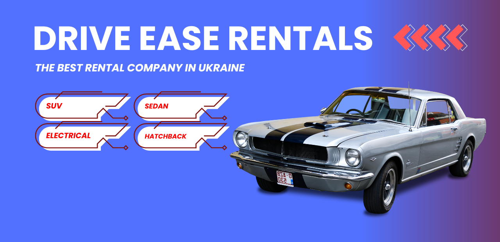

# Rental Car Platform

This Rental Car Platform is a web application that allows users to browse, filter, and book car rentals. The platform displays a variety of cars, along with detailed information about their specifications, rental conditions, and availability. It includes a user-friendly interface, which facilitates an easy and efficient booking process for customers.

---



### Features

- **Car Listings:** Browse through an extensive list of available cars.
- **Detailed Car Information:** Each car has a detailed description, including make, model, year, fuel consumption, engine size, and more.
- **Rental Conditions:** Display specific rental conditions like minimum age, required documents, and security deposit details.
- **Modal Window for Car Details:** Clicking on a car shows a modal with full details and additional information about accessories and functionalities.
- **Backend Integration:** Handles real-time data from the backend for dynamic car availability and rental conditions.

---

### Installation

1. Clone the repository:

```
git clone https://github.com/yaroslav-mudrevskyi/Rental-Car.git
```

2. Install the necessary dependencies:

```
npm install
```

3. Start the application:

```
npm run dev
```

---

### Usage

- Navigate through the car listings.
- Click on any car to view its detailed information in a modal window.
- Scroll through the rental conditions and accessories.
- Close the modal and continue browsing or initiate a booking.

---

### Technologies Used

- **React:** For building the UI components.
- **Redux:** For state management of the modal and car data.
- **React-Modal:** To handle the display of car details in a modal window.
- **Axios**: For making HTTP requests to interact with external APIs and the backend.
- **CSS Modules:** For component-level styling.
- **JavaScript:** Core language for logic implementation.

---

### Contact

Yaroslav Mudrevskyi - [[yarikyaroslav13200@gmail.com]](mailto:yarikyaroslav13200@gmail.com)
